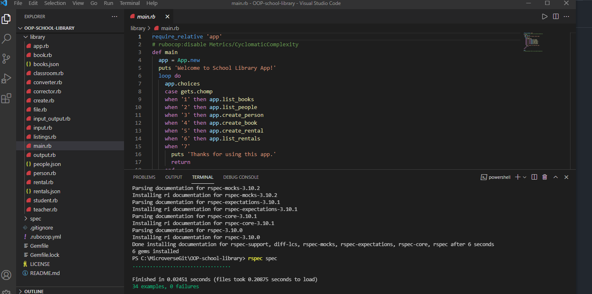

# OOP-school-library
  
 

  <em align="center" style>"Implementation of classes and objects in Ruby, also encapsulation and inheritance with Ruby."</em>
 

This repository aims to practice OOP(Object Oriented Programming) for best practice. App School Library was made with Ruby Language.

## Getting Started

This repository is located on Github and you can get a copy with this link [here](https://github.com/leonardoeng13/OOP-school-library.git)

In your terminal, go to the source code folder and execute "ruby ./library/main.rb".

## Testing

From your terminal window inside of Visual Studio code run: "gem install rspec" and then  "rspec spec"

## Author

👤 **Leonardo de Andrade**

- GitHub: [Leo de Andrade](https://github.com/leonardoeng13)
- LinkedIn : [Leonardo de Andrade](https://www.linkedin.com/in/leonardodeandrade)
- Twitter: [Leo de Andrade](https://twitter.com/andrede_leo)

👤 **Herbert**

- GitHub: [Herbert](https://github.com/herokudev)
- LinkedIn: [Herbert](https://www.linkedin.com/in/herbert-orellana)
- Twitter: [v](https://twitter.com/HerbertOrellan4)

## 🤝 Contributing

Contributions, issues, and feature requests are welcome!

Feel free to check the [issues page](https://github.com/leonardoeng13/OOP-school-library/issues).

## Show your support

Give a ⭐️ if you like this project!

## 📝 License

This project is [MIT](https://github.com/leonardoeng13/OOP-school-library/blob/dev/LICENSE) licensed.